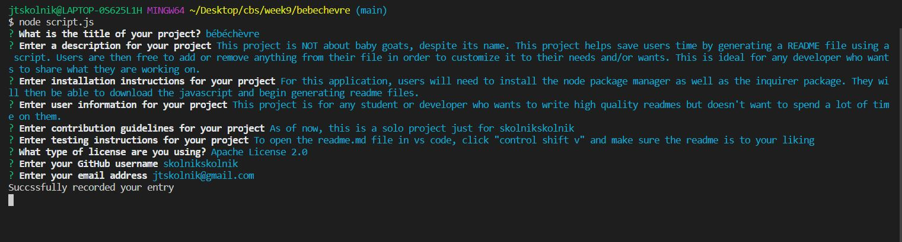
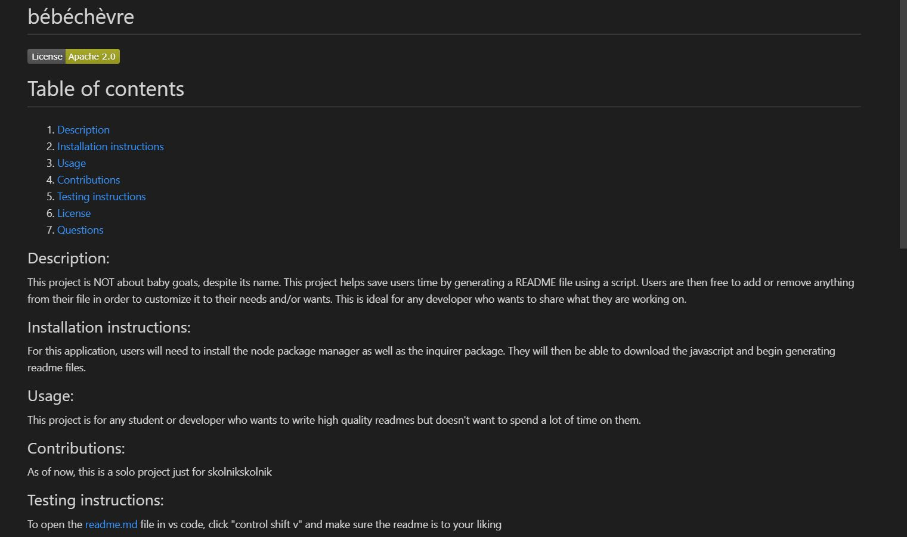

# bébéchèvre 

# Table of contents
1. [Description](#Description)
2. [Installation instructions](#Installation-instructions)
3. [Usage](#usage)
4. [Testing instructions](#Testing-instructions)
5. [Questions](#Questions)

## Description: 
This project is NOT about baby goats, despite its name. This project helps save users time by generating a README file using a script. Users are then free to add or remove anything from their file in order to customize it to their needs and/or wants. This is ideal for any developer who wants to share what they are working on.

Here is a [link](https://youtu.be/8It383aUTiY) to a youtube video of the working product. 

Here is what entering input looks like:

Here is what the readme looks like in VScode:

## Installation instructions: 
For this application, users will need to install the node package manager as well as the inquirer package. They will then be able to download the javascript and begin generating readme files. 

## Usage: 
This project is for any student or developer who wants to write high quality readmes but doesn't want to spend a lot of time on them. 

## Testing instructions: 
To open the readme.md file in vs code, click "control shift v" and make sure the readme is to your liking

## Questions
Visit my [github page](http.www.github.com/skolnikskolnik).  return 
Email me at jtskolnik@gmail.com with any additional questions you may have. I am always happy to talk to users of my product!